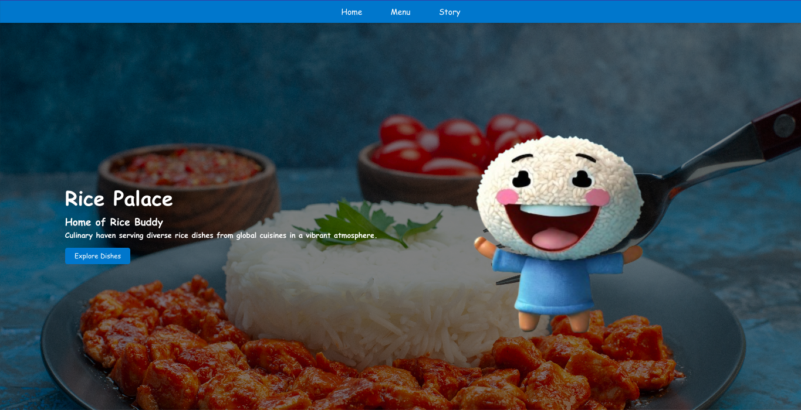

Certainly! Here's the complete README.md file generated based on our conversation:

````markdown
# Rice Palace 🍚

Welcome to Rice Palace, your go-to destination for delicious rice dishes from around the world. Whether you're craving biryani, paella, or jollof rice, we've got you covered!



## Table of Contents

- [Description](#description)
- [Installation](#installation)
- [Usage](#usage)
- [Contributing](#contributing)
- [License](#license)

## Description

Rice Palace is a modern web application that offers a variety of rice-based dishes, including biryani, paella, jollof rice, and more. The application provides an intuitive interface for users to explore the menu, learn about different rice cuisines, and enjoy a visually appealing experience.

## Installation

To install Rice Palace locally, follow these steps:

1. Clone the repository:

   ```bash
   git clone https://github.com/freddyfavour/rice-palace.git
   ```
````

2. Navigate to the project directory:

   ```bash
   cd rice-palace
   ```

3. Install dependencies:

   ```bash
   npm install
   ```

## Usage

To start the application, run the following command:

```bash
npm start
```

Visit [http://localhost:3000](http://localhost:3000) in your web browser to view Rice Palace. Explore the menu, discover mouthwatering options, and indulge in the flavors of different cultures.

## Contributing

Contributions are welcome! If you'd like to contribute to Rice Palace, please follow these steps:

1. Fork the repository.
2. Create a new branch for your feature or bug fix.
3. Make your changes and commit them.
4. Push your changes to your fork.
5. Submit a pull request to the main repository.

Please ensure that your code follows the project's coding standards and conventions. Your contributions help improve the application and make it better for everyone.

## License

This project is licensed under the [MIT License](LICENSE). Feel free to use, modify, and distribute the code for your own projects.
